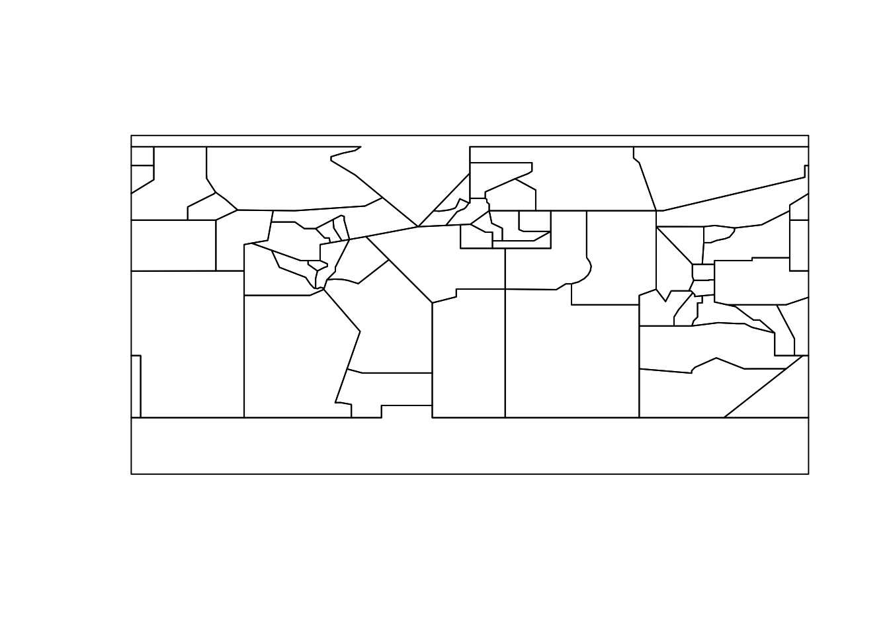

<!-- README.md is generated from README.Rmd. Please edit that file -->
`asam` is an R package providing tools to access, download, update, process and visualize [Anti-shipping Activity Messages](http://msi.nga.mil/NGAPortal/MSI.portal?_nfpb=true&_pageLabel=msi_portal_page_65) (ASAM) Database Files

Anti-shipping Activity Messages (ASAM) include the locations and descriptive accounts of specific hostile acts against ships and mariners. The reports may be useful for recognition, prevention and avoidance of potential hostile activity. The 'asam' package provides a snapshot of the official ASAM database, utilities to update the local database and the official polygons defining the ASAM global regions and subregions.

The following functions are implemented:

-   `asam_refresh`: Refresh ASAM database
-   `asam_shp`: ASAM (Anti-shipping Activity Messages) Data (shapefile)
-   `asam_subregions`: Retrieve ASAM subregions polygons

The following data sets are included:

-   `data(asam_shp)` : Snapshot of the ASAM dataset
-   `system.file("geojson/asam.geojson", package="asam")` : Official ASAM regions & subregions shapefile

### News

-   Version 0.0.0.9000 released

### Installation

``` r
devtools::install_github("hrbrmstr/asam")
```

### Usage

``` r
library(asam)

# current verison
packageVersion("asam")
#> [1] '0.0.0.9000'
```

### Test Results

``` r
library(asam)
library(testthat)
library(sp)

date()
#> [1] "Sat Sep 19 13:39:31 2015"

subregions <- asam_subregions()
plot(subregions)
```



``` r

test_dir("tests/")
#> testthat results ========================================================================================================
#> OK: 0 SKIPPED: 0 FAILED: 0
#> 
#> DONE
```

### Code of Conduct

Please note that this project is released with a [Contributor Code of Conduct](CONDUCT.md). By participating in this project you agree to abide by its terms.
