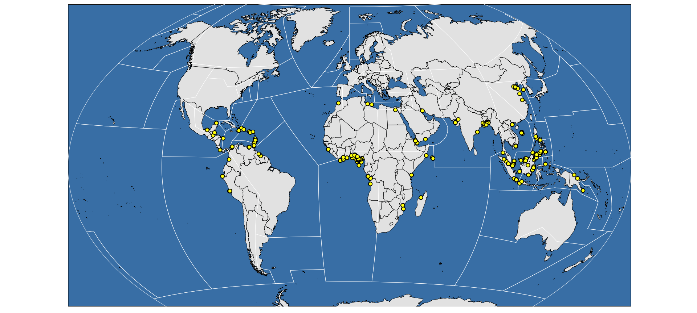

<!-- README.md is generated from README.Rmd. Please edit that file -->


`asam` is an R package providing tools to access, download, update, process and visualize [Anti-shipping Activity Messages](http://msi.nga.mil/NGAPortal/MSI.portal?_nfpb=true&_pageLabel=msi_portal_page_65) (ASAM) Database Files

Anti-shipping Activity Messages (ASAM) include the locations and descriptive accounts of specific hostile acts against ships and mariners. The reports may be useful for recognition, prevention and avoidance of potential hostile activity. The 'asam' package provides a snapshot of the official ASAM database, utilities to update the local database and the official polygons defining the ASAM global regions and subregions.

The following functions are implemented:

-   `asam_refresh`: Refresh ASAM database
-   `asam_subregions`: Retrieve ASAM subregions polygons as either a `SpatialPolygonsDataFrame` or simple features collection

The following data sets are included:

-   `data(asam_shp)` : Snapshot of the ASAM dataset (spatial/shapefile)
-   `data(asam_sf)` : Snapshot of the ASAM dataset (simple features collection)
-   `system.file("geojson/asam.geojson", package="asam")` : Official ASAM regions & subregions shapefile

### Installation

``` r
devtools::install_github("hrbrmstr/asam")
```

### Usage

``` r
library(asam)

# current verison
packageVersion("asam")
#> [1] '0.1.0'
```

### Test Results

``` r
library(asam)
library(testthat)
library(sp)
library(ggplot2)
library(ggthemes)
library(ggalt)
library(tidyverse)

date()
#> [1] "Sun Jun 18 09:37:15 2017"
```

*See the subregion map*

``` r
subregions <- asam_subregions()
plot(subregions)
```


*Find all the incidents by pirates this year*

``` r
data(asam_sf)

filter(asam_sf, grepl("(pira|rob|hie|band|aila|jack|trud)", 
                      Aggressor, ignore.case=TRUE),
          lubridate::year(DateOfOcc) == 2016) %>% 
  pull(geometry) %>% 
  as("Spatial") %>% 
  as_data_frame() -> pirates

pirates
#> # A tibble: 473 x 2
#>    coords.x1  coords.x2
#>        <dbl>      <dbl>
#>  1 105.16667   3.000000
#>  2 116.80000  -1.466667
#>  3 -77.18333 -12.016667
#>  4 -75.55000  10.316667
#>  5 -69.31667  19.200000
#>  6 121.73333   5.883333
#>  7 101.50000   1.683333
#>  8 -65.43333  18.150000
#>  9 101.48333   1.700000
#> 10 112.50000  16.183333
#> # ... with 463 more rows
```

*and plot them*

``` r
subregions_map <- fortify(subregions)
#> Regions defined for each Polygons
world <- map_data("world")
#> 
#> Attaching package: 'maps'
#> The following object is masked from 'package:purrr':
#> 
#>     map

gg <- ggplot()
gg <- gg + geom_cartogram(data=world, map=world,
                    aes(x=long, y=lat, map_id=region),
                    color="black", fill="#e7e7e7", size=0.15)
gg <- gg + geom_cartogram(data=subregions_map, map=subregions_map,
                    aes(x=long, y=lat, map_id=id),
                    color="white", fill="white", size=0.15, alpha=0)
gg <- gg + geom_point(data=pirates, color="black", fill="yellow", 
                      aes(x=coords.x1, y=coords.x2), shape=21)
gg <- gg + xlim(-170, 170)
gg <- gg + ylim(-58, 75)
gg <- gg + coord_proj("+proj=wintri")
gg <- gg + theme_map()
gg <- gg + theme(panel.background=element_rect(fill="steelblue"))
gg
```



### Code of Conduct

Please note that this project is released with a [Contributor Code of Conduct](CONDUCT.md). By participating in this project you agree to abide by its terms.
